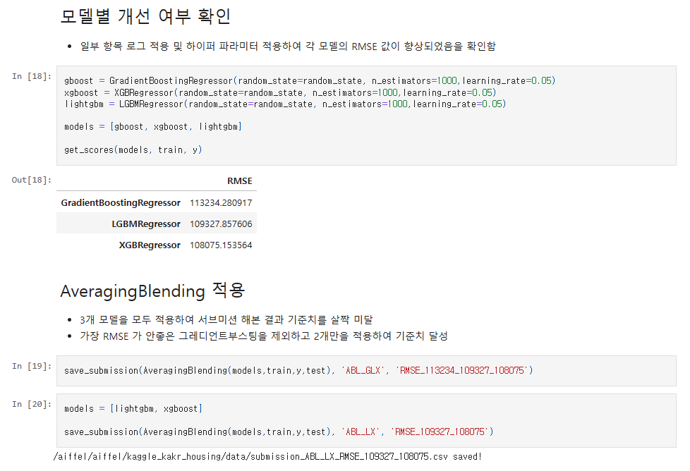
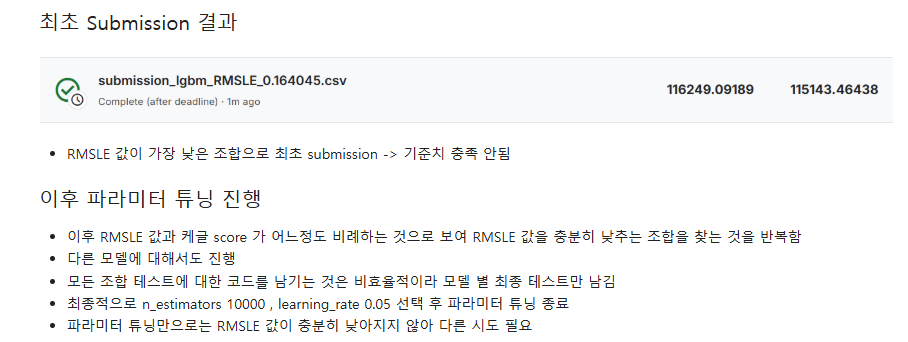
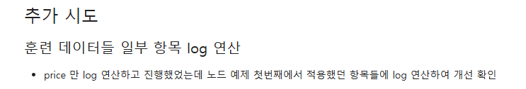
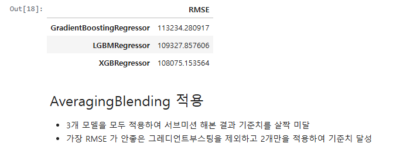
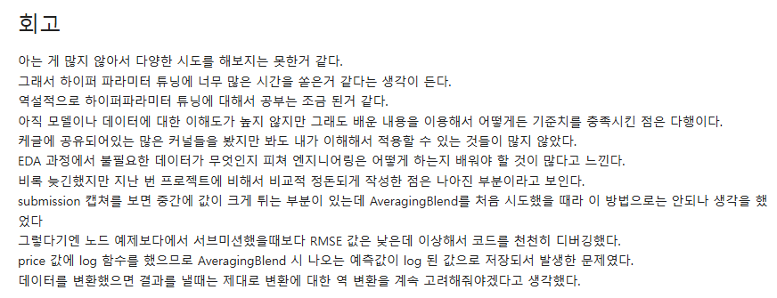

# AIFFEL Campus Online Code Peer Review Templete
- 코더 : 강희봉
- 리뷰어 : 김성훈


# PRT(Peer Review Template)
- [x]  **1. 주어진 문제를 해결하는 완성된 코드가 제출되었나요?**

    
    
- [x]  **2. 전체 코드에서 가장 핵심적이거나 가장 복잡하고 이해하기 어려운 부분에 작성된 
주석 또는 doc string을 보고 해당 코드가 잘 이해되었나요?**
    
    - 다른 부분들도 물론 좋은 영향이 있었지만 전체 내용에서 목표 점수에 도달하기 위해 가장 핵심이 되는 부분이라고 생각합니다.
    
    
        
- [x]  **3. 에러가 난 부분을 디버깅하여 문제를 해결한 기록을 남겼거나
새로운 시도 또는 추가 실험을 수행해봤나요?**
    - 가벼운 시도로 점수를 확인하고 이를 개선하기 위해 점차적으로 추가 Feature Engineering을 시도하고, 하이퍼파라미터를 개선하는 과정이 기록되어있었습니다.
     
    
    
    

        
- [x]  **4. 회고를 잘 작성했나요?**

    
        
- [x]  **5. 코드가 간결하고 효율적인가요?**
    - 전체적으로도 그렇고 함수로 전체 과정을 잘 묶어두어 불필요한 반복없이 간결하고 가독성이 좋은 코드였습니다.
     

# 회고(참고 링크 및 코드 개선)
```
- 반복되는 작업은 함수로 묶어 이후 진행과정을 보다 깔끔하게 표현한 부분을 꼭 본 받아야겠다고 생각했습니다.
- Grid Search를 이용하여 파라미터를 다양하게 실험한 후 Average Blending을 적용할 때 모델을 넣고 빼는 테스트를 통해 정확도를 올리는 부분이 좋았습니다.
- 복잡한 과정없이 한 단계씩 성능을 끌어올리는 부분도 배울만한 부분이었습니다.
```
