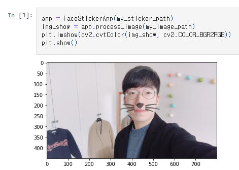
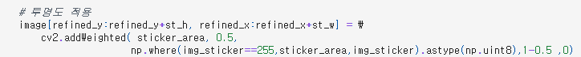
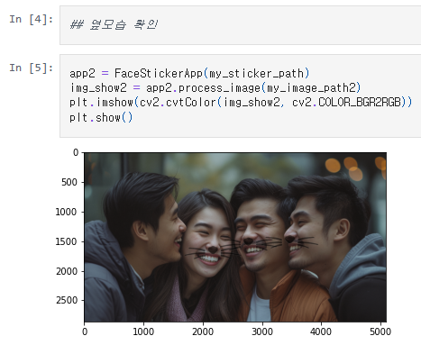
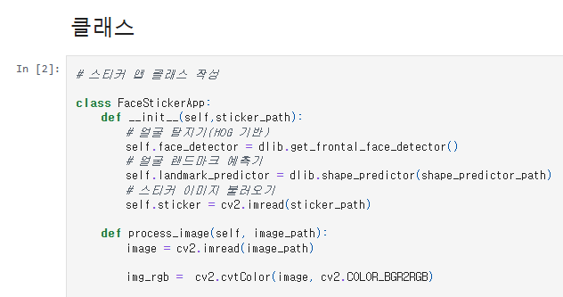

# AIFFEL Campus Online Code Peer Review Templete
- 코더 : 강희봉
- 리뷰어 : 김성훈


# PRT(Peer Review Template)
- [x]  **1. 주어진 문제를 해결하는 완성된 코드가 제출되었나요?**
    - 문제에서 요구하는 최종 결과물이 첨부되었는지 확인
      
      
      - 스티커가 적당한 위치에 `addweighted()` 함수를 사용하여 투명하게 적용되었습니다.

        
        - 다양한 각도, 옆모습, 어두운 곳과 먼곳등에서 발생하는 문제를 확인하기 위해 시도해보았습니다.
    
    
- [x]  **2. 전체 코드에서 가장 핵심적이거나 가장 복잡하고 이해하기 어려운 부분에 작성된 
주석 또는 doc string을 보고 해당 코드가 잘 이해되었나요?**
    
        - 간결하고 명료한 코드와 기능마다 주석이 달려있어서 잘 이해되었습니다.
       
- [x]  **3. 에러가 난 부분을 디버깅하여 문제를 해결한 기록을 남겼거나
새로운 시도 또는 추가 실험을 수행해봤나요?**
    - 다양한 상황의 사진으로 문제를 확인해보았습니다.
        
- [x]  **4. 회고를 잘 작성했나요?**

        
- [x]  **5. 코드가 간결하고 효율적인가요?**
    - 앞서 2번에서 언급한대로 class로 전체 과정이 잘 정리되어 이후 코드 진행 시 깔끔한 몇 줄의 코드로 효율적인 모습을 보입니다.


# 회고(참고 링크 및 코드 개선)
```
저와는 달리 addweight함수를 금방 잘 적용하신 부분이 놀라웠고, Class의 __init__부분으로 반복이 불필요한 모델 불러오기 작업 등이 반복되지 않으면서 전체 스티커 앱으로써 완성도 있는 모습이었습니다. 배울점이 많은 코드여서 좋은 시간이었습니다.
감사합니다.
```
