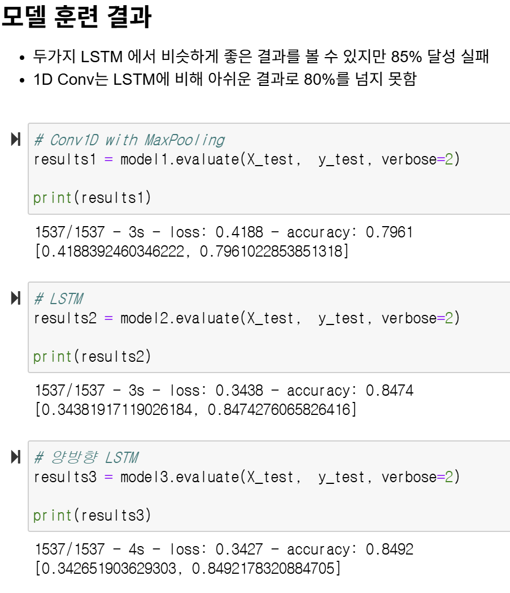
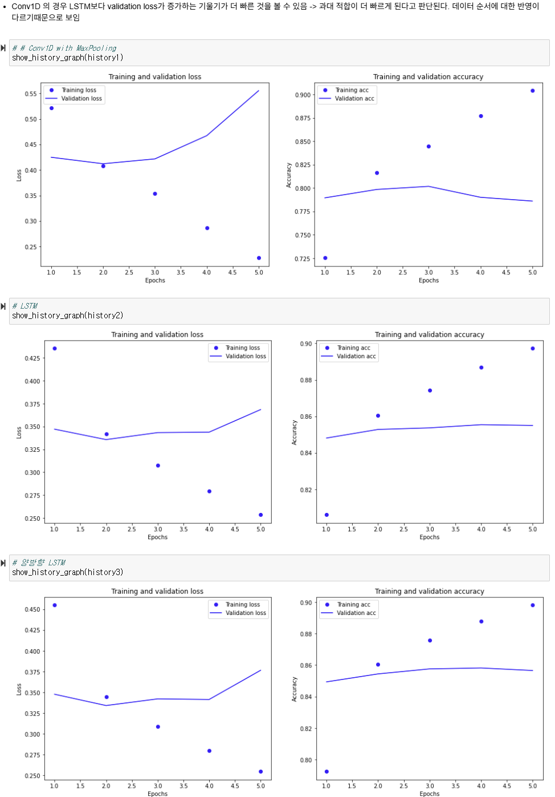
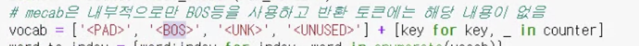
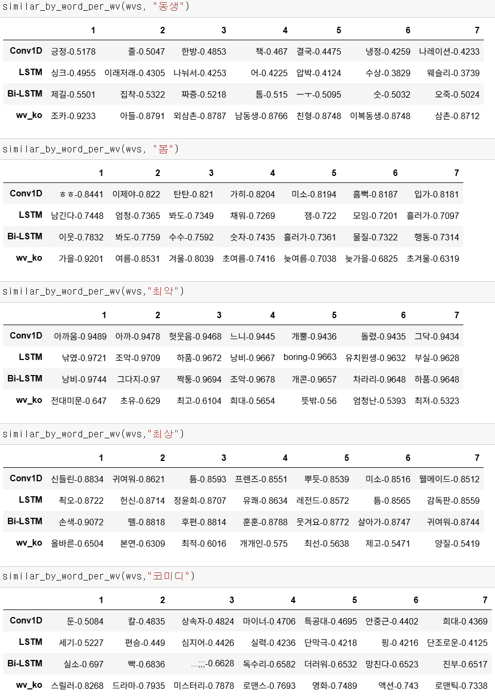
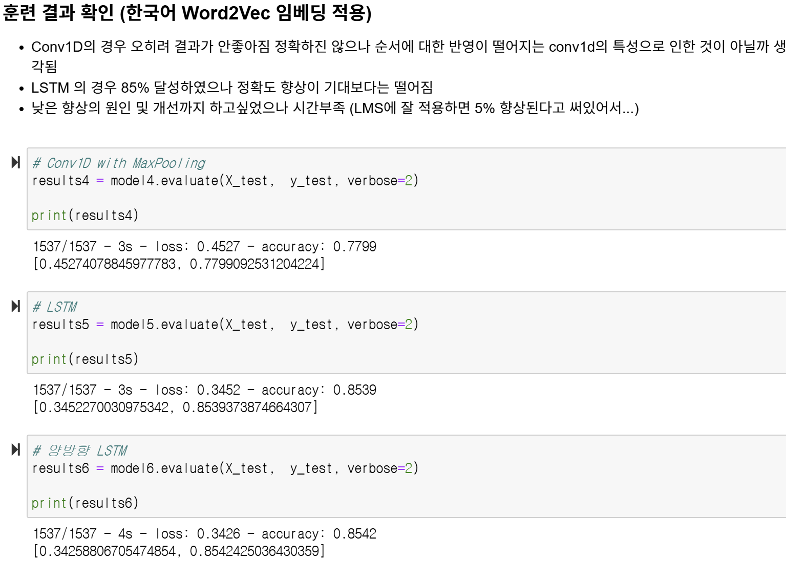
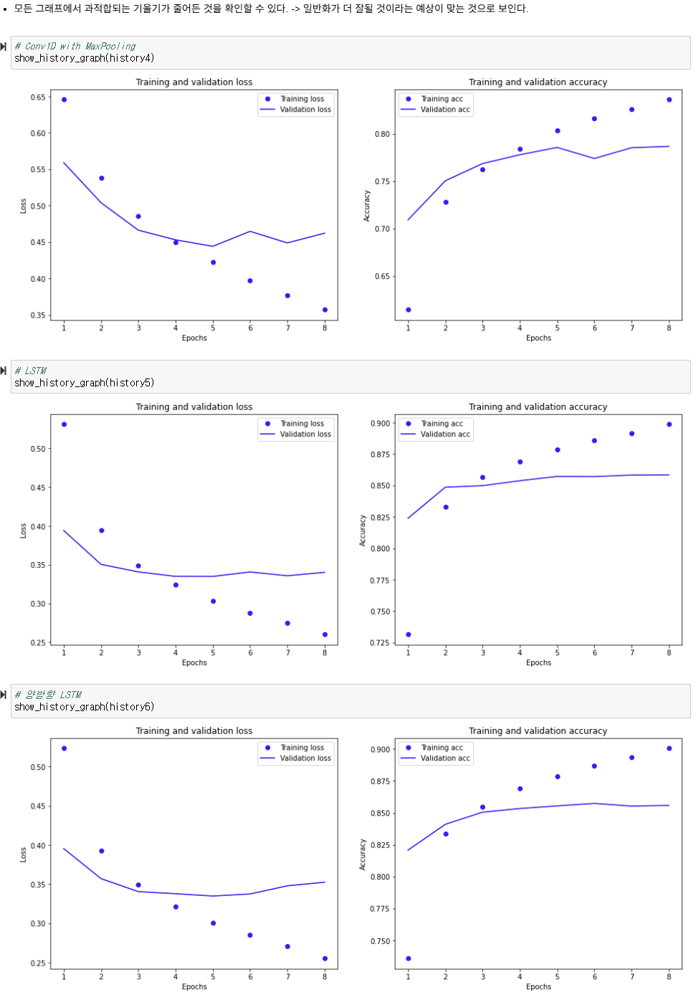
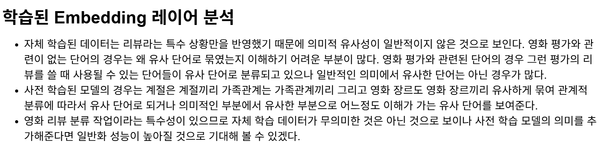
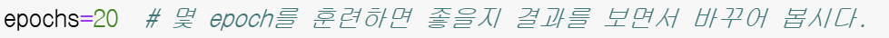
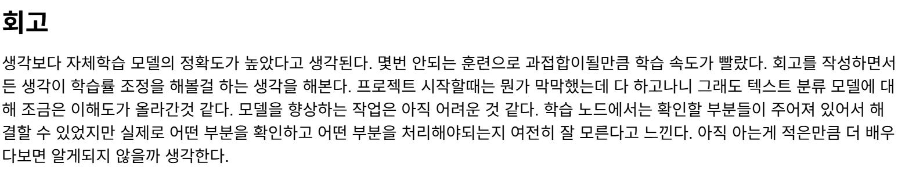

# AIFFEL Campus Online Code Peer Review Templete
- 코더 : 강희봉
- 리뷰어 : 김지환


# PRT(Peer Review Template)
- [ ]  **1. 주어진 문제를 해결하는 완성된 코드가 제출되었나요?**
    - 문제에서 요구하는 최종 결과물이 첨부되었는지 확인
        - 중요! 해당 조건을 만족하는 부분을 캡쳐해 근거로 첨부
        
        
        
        
        
        
    
- [ ]  **2. 전체 코드에서 가장 핵심적이거나 가장 복잡하고 이해하기 어려운 부분에 작성된 
주석 또는 doc string을 보고 해당 코드가 잘 이해되었나요?**
    - 해당 코드 블럭을 왜 핵심적이라고 생각하는지 확인
    - 해당 코드 블럭에 doc string/annotation이 달려 있는지 확인
    - 해당 코드의 기능, 존재 이유, 작동 원리 등을 기술했는지 확인
    - 주석을 보고 코드 이해가 잘 되었는지 확인
        - 중요! 잘 작성되었다고 생각되는 부분을 캡쳐해 근거로 첨부
        
        > 학습된 embedding 레이어를 철저하게 분석하심
        
- [ ]  **3. 에러가 난 부분을 디버깅하여 문제를 해결한 기록을 남겼거나
새로운 시도 또는 추가 실험을 수행해봤나요?**
    - 문제 원인 및 해결 과정을 잘 기록하였는지 확인
    - 프로젝트 평가 기준에 더해 추가적으로 수행한 나만의 시도, 
    실험이 기록되어 있는지 확인
        - 중요! 잘 작성되었다고 생각되는 부분을 캡쳐해 근거로 첨부
        
        > Conv1D with MaxPooling, LSTM, 양방향 LSTM 총 6개의 모델에 대해 좋은 결과를 얻기 위해 훈련을 통해 epoch를 바꾸어 보심
        
- [ ]  **4. 회고를 잘 작성했나요?**
    - 주어진 문제를 해결하는 완성된 코드 내지 프로젝트 결과물에 대해
    배운점과 아쉬운점, 느낀점 등이 기록되어 있는지 확인
    - 전체 코드 실행 플로우를 그래프로 그려서 이해를 돕고 있는지 확인
        - 중요! 잘 작성되었다고 생각되는 부분을 캡쳐해 근거로 첨부
        
        
- [ ]  **5. 코드가 간결하고 효율적인가요?**
    - 파이썬 스타일 가이드 (PEP8) 를 준수하였는지 확인
    - 코드 중복을 최소화하고 범용적으로 사용할 수 있도록 함수화/모듈화했는지 확인
        - 중요! 잘 작성되었다고 생각되는 부분을 캡쳐해 근거로 첨부
        > 코드를 읽기 쉽게 주석을 필요한 곳곳마다 달아주셨음


# 회고(참고 링크 및 코드 개선)
```
# 감성 분석에는 한글 외 문자를 제거하신 게 인상적이었다. 확실히 감성 분석에 방해가 될 수 있는 정보가 있을 거다.
# 6-1에서 예시 답안을 보면 vocab 변수에 '<PAD>', '<BOS>', '<UNK>', '<UNUSED>' 이 토큰들이 ''로 대체되어 있는 걸 볼 수가 있는데 Mecab은 내부적으로만 BOS 등을 사용하고 반환 토큰에는 해당 내용이 없어서 그런지는 몰랐었다. Mecab에 대해 더 알아봐야 할 것 같다.
```
