# AIFFEL Campus Online Code Peer Review Templete
- 코더 : 강희봉
- 리뷰어 : 신기성


# PRT(Peer Review Template)
- [ ]  **1. 주어진 문제를 해결하는 완성된 코드가 제출되었나요?**
    - 네 문제에서 요구하는 해결 된 완성된 코드가 제출 되었습니다.
        - 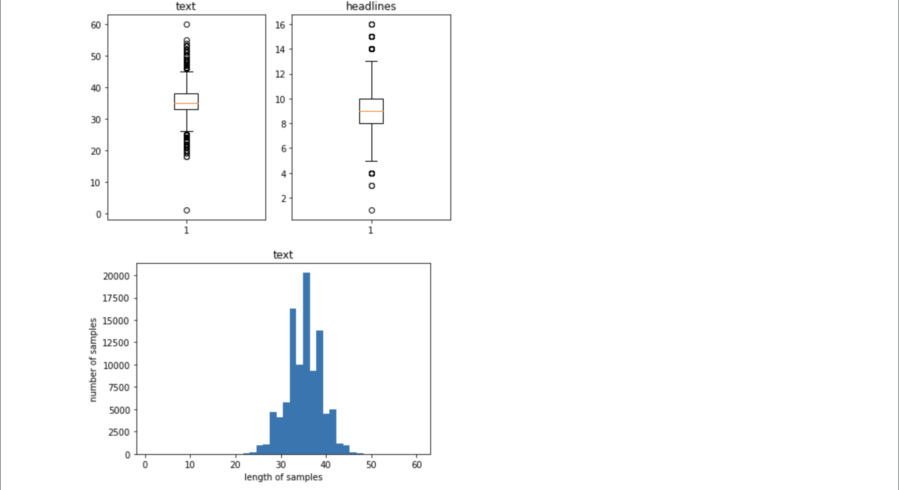
	  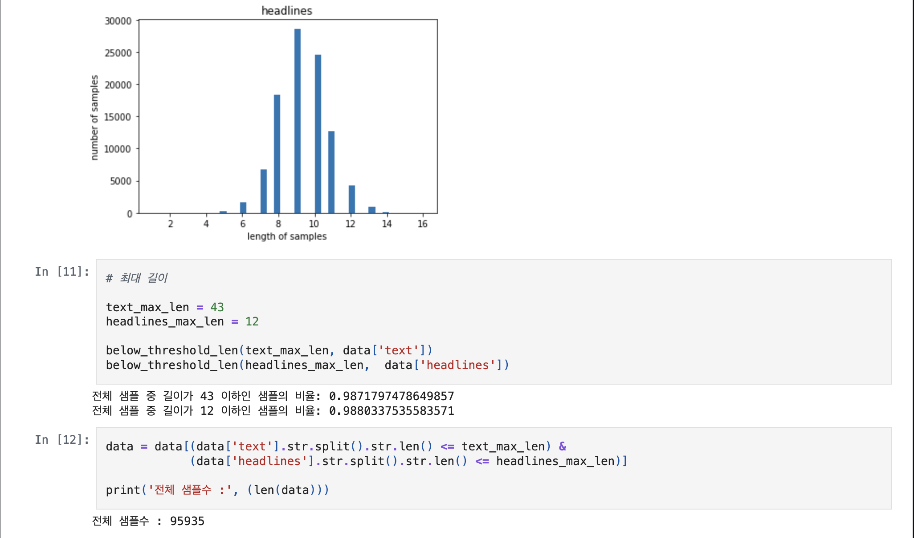
	  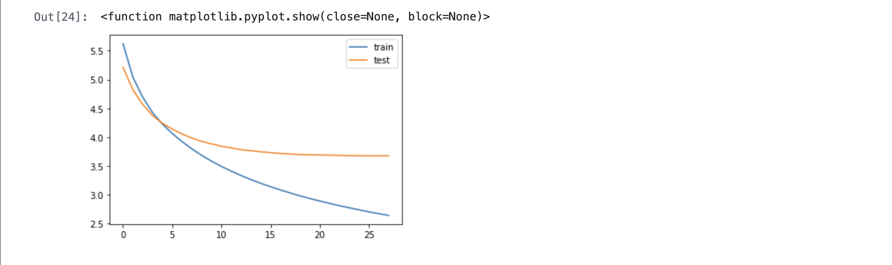
	  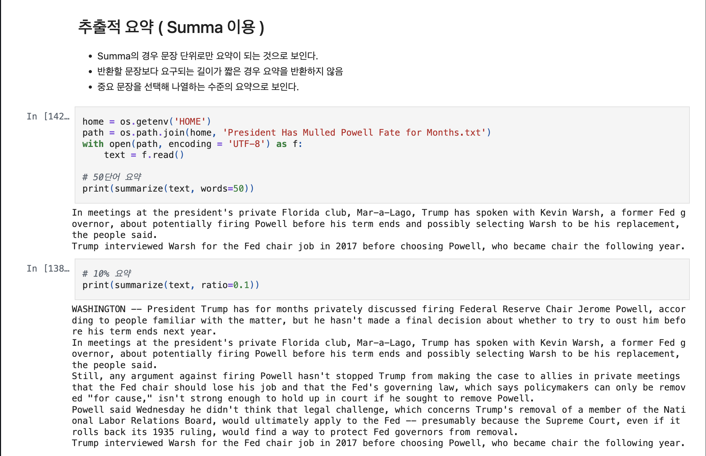
	  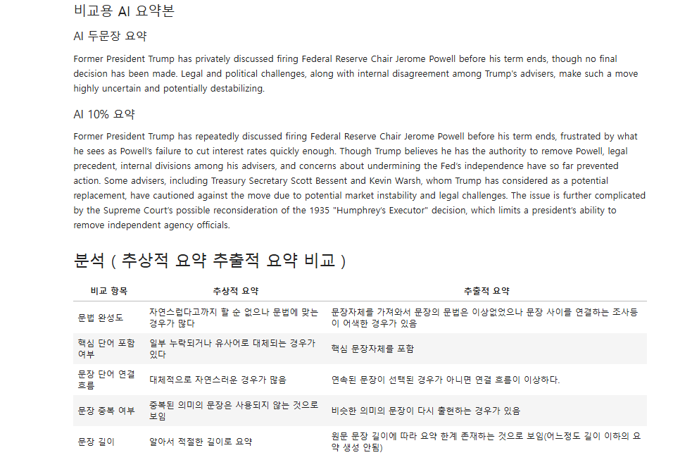
    
- [ ]  **2. 전체 코드에서 가장 핵심적이거나 가장 복잡하고 이해하기 어려운 부분에 작성된 
주석 또는 doc string을 보고 해당 코드가 잘 이해되었나요?**
    - 해당 코드 블럭들은 데이터를 불러오고 읽어와서 전처리 과정을 나타낸 부분입니다. 
이부분이 중요한 이유는 전처리 프로세스가 확실히 되야 모델의 표현력이 좋아지기 때문입니다.
    - 해당 부분의 annotation 및 doc string등이 제대로 서술 되어 있습니다. 
    - 해당 코드의 기능,  존재 이유 및  작동 원리 등을 간단하게 주석으로 설명을 해놓았습니다.
    - 따라서 주어진 주석을 보고 어느정도 이해는 가는것 같습니다.
        - 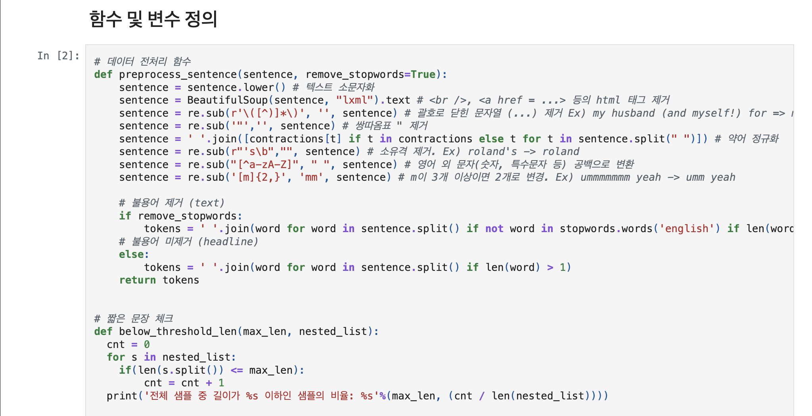
	  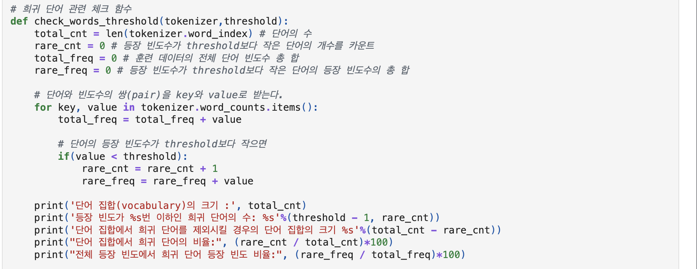
	  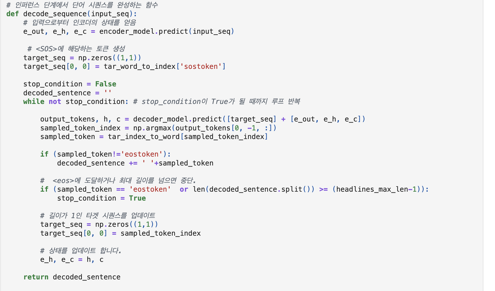
	  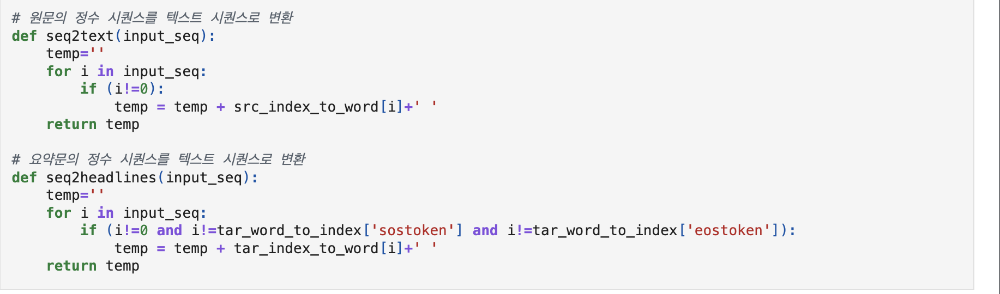
        
- [ ]  **3. 에러가 난 부분을 디버깅하여 문제를 해결한 기록을 남겼거나
새로운 시도 또는 추가 실험을 수행해봤나요?**
    - 네 모델을 재훈련 하는데 시간이 오래 걸려 data를 추가로 읽어드려 처리하는 방법을 시도하였습니다.
    - data를 추가로 읽어드림으로써 다음과 같이 랜섬 샘플링을 위한 고유한 인덱스 10개를 생성하고 거기서 decoder input test 에서 인덱스에 해당하는 텍스트를 추출하고 그걸 seq2headlines으로 변환하여 예측된 요약을 생성해서 보여주는 코드를 작성하고 기록하였습니다.
        - 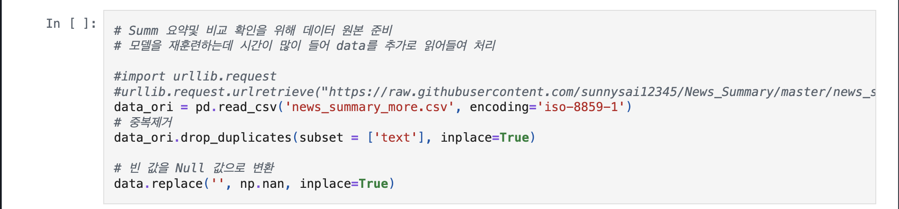
	  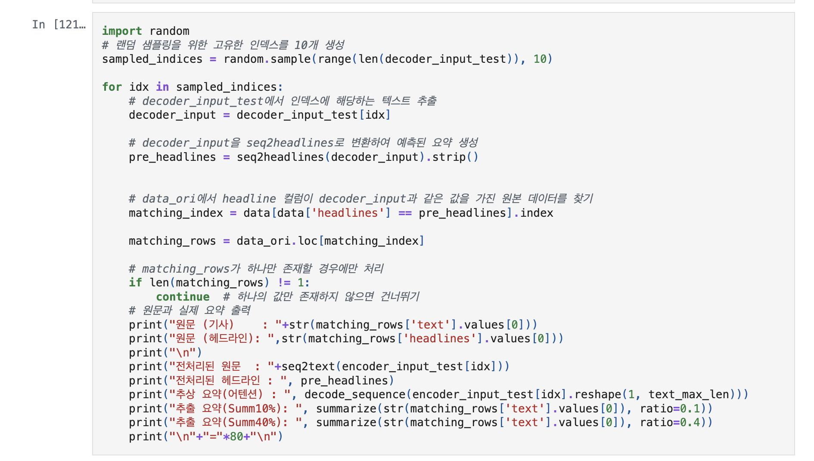
	  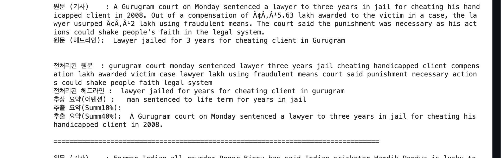
        
- [ ]  **4. 회고를 잘 작성했나요?**
    - 주어진 문제를 해결하는 완성된 코드에 대해서 배운점 아쉬운 점등을 잘 서술하였습니다.
    - 또한 전체 코드에 대한 내용을 설명하는 방식으로 리뷰어에게 이해를 돕기 쉽게 설명하였습니다.
        - 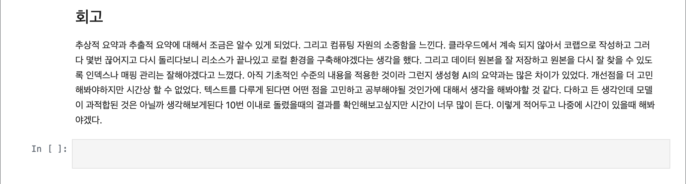
        
- [ ]  **5. 코드가 간결하고 효율적인가요?**
    - 네, 파이썬 스타일 가이드 (PEP8) 를 준수하였는지 확인하였습니다.
    - 코드 중복을 최소화하고 범용적으로 사용할 수 있도록 함수화/모듈화했는지 확인하였습니다.
        - 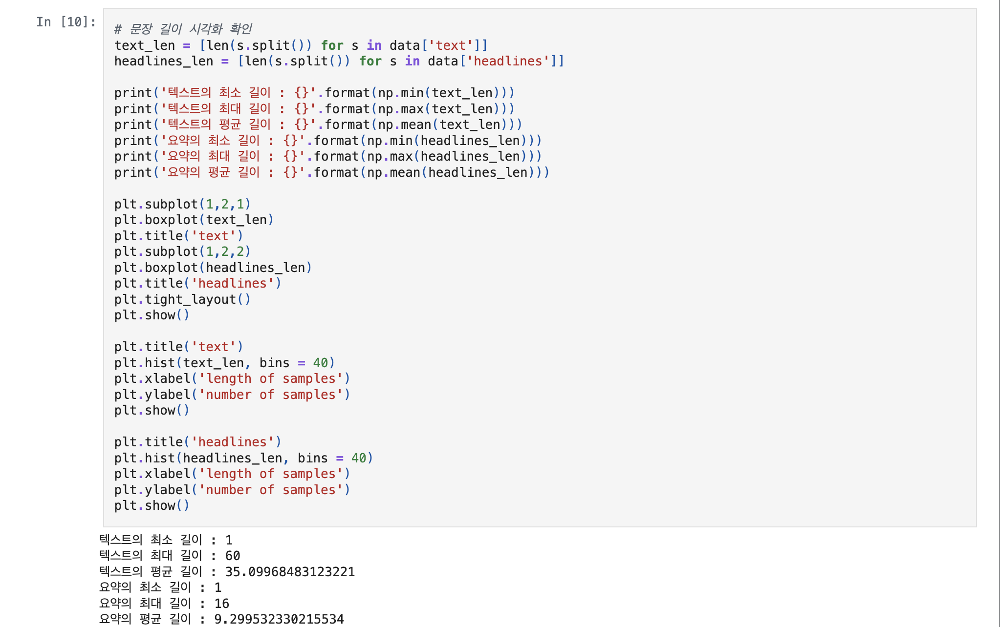


# 회고(참고 링크 및 코드 개선)
```
# 코드가 짜임새있게 잘짜져있고 깔끔해서 리뷰어의 이해를 돕는것 같습니다.
# 코드 리뷰 시 저는 https://github.com/sunnysai12345/News_Summary 이 링크를 참조하였습니다.
# 아쉬운점은 기존에 주어진 new_summar 외의 다른 내용으로도 시도를 해보았으면 어땠을까 싶습니다. 하지만 본 내용이 다른 내용에 대해서 하는건 아니었기 때문에 사실 이건 개인적인 생각입니다. 
```
