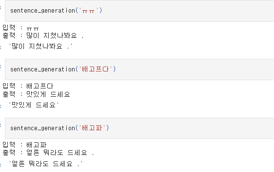
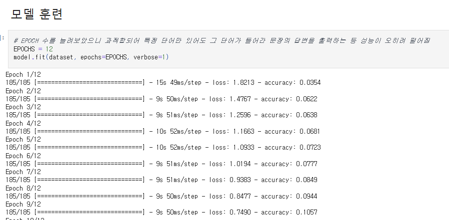
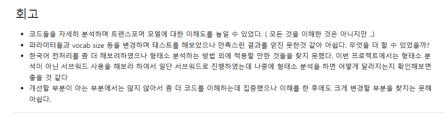
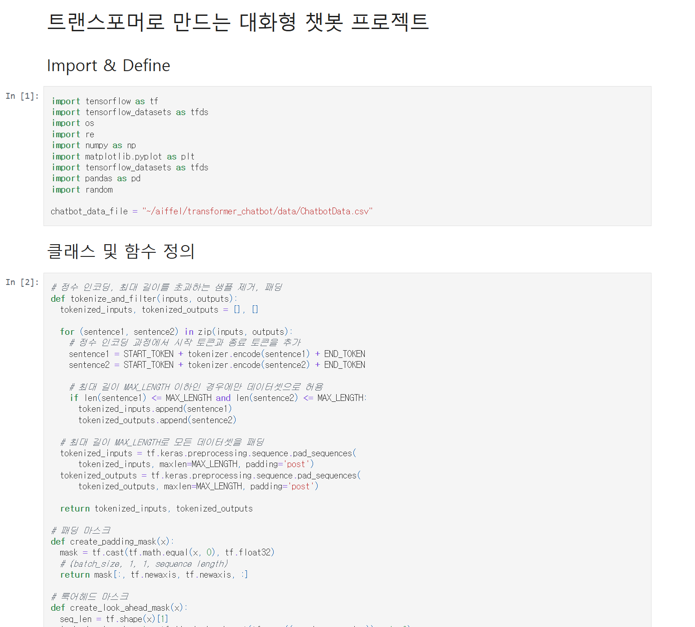
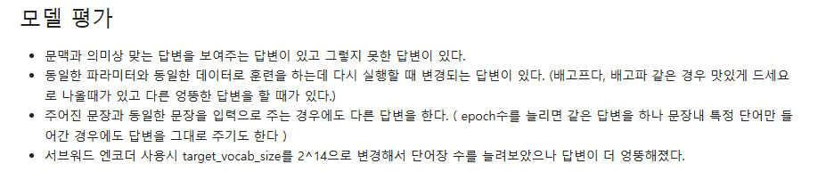

# AIFFEL Campus Online Code Peer Review Templete
- 코더 : 강희봉
- 리뷰어 : 김현진진

# PRT(Peer Review Template)
- [x]  **1. 주어진 문제를 해결하는 완성된 코드가 제출되었나요?**
    - 문제에서 요구하는 최종 결과물이 첨부되었는지 확인
        - 중요! 해당 조건을 만족하는 부분을 캡쳐해 근거로 첨부
        한국어로 답변을 받았다. 자연스러운,비자연스러운 답변이 섞여있다.
        
    
- [ ]  **2. 전체 코드에서 가장 핵심적이거나 가장 복잡하고 이해하기 어려운 부분에 작성된 
주석 또는 doc string을 보고 해당 코드가 잘 이해되었나요?**
    어떤부분이 핵심인지 찾기는 어려웠다.핵심부분을 주석이나 마크다운으로 표현해주면 좋을 것 같다.
        
- [x]  **3. 에러가 난 부분을 디버깅하여 문제를 해결한 기록을 남겼거나
새로운 시도 또는 추가 실험을 수행해봤나요?**
    - 문제 원인 및 해결 과정을 잘 기록하였는지 확인
    - 프로젝트 평가 기준에 더해 추가적으로 수행한 나만의 시도, 
    실험이 기록되어 있는지 확인
        - 중요! 잘 작성되었다고 생각되는 부분을 캡쳐해 근거로 첨부
        자연스러운 대화를 위해 추가적으로 변형을 하였다.
        
        
- [x]  **4. 회고를 잘 작성했나요?**
    - 주어진 문제를 해결하는 완성된 코드 내지 프로젝트 결과물에 대해
    배운점과 아쉬운점, 느낀점 등이 기록되어 있는지 확인
    - 전체 코드 실행 플로우를 그래프로 그려서 이해를 돕고 있는지 확인
        - 중요! 잘 작성되었다고 생각되는 부분을 캡쳐해 근거로 첨부
        어떤부분을 더 하고자 하였는지 작성하여 이해하기 수월하였다다
        
        
- [x]  **5. 코드가 간결하고 효율적인가요?**
    - 파이썬 스타일 가이드 (PEP8) 를 준수하였는지 확인
    - 코드 중복을 최소화하고 범용적으로 사용할 수 있도록 함수화/모듈화했는지 확인
        - 중요! 잘 작성되었다고 생각되는 부분을 캡쳐해 근거로 첨부
        전체적인 작동부분에 따라 구분을 하여 보기 좋았으나,부분적으로는 함수부분 코드가 길어 하나씩 보기 힘들었다.함수부분도
        비슷한 동작을 하는 부분을 나누어주면 보기에는 더 편할 것 같다.
        

# 회고(참고 링크 및 코드 개선)

임베딩을 변경하였고,자연스러운 답변을 위해 에폭과 여러부분을 시도한 부분이 좋았다.엉뚱한 답변을 할떄도 있었지만,정상적인 답변을 하는 것을 보아 여러가지 전처리나 모델을 변경을 하든지 해결방식에 대해 같이 고민할 수 있어 좋았다.
    
